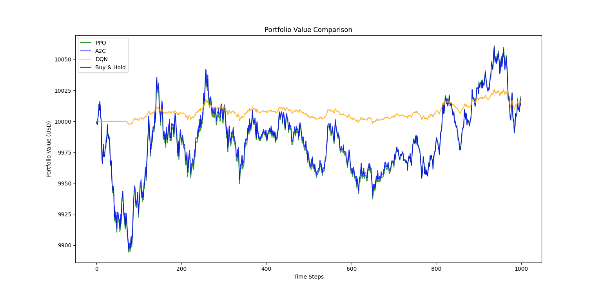

# RL Crypto Trading Bot

[](https://www.python.org/)
[](https://opensource.org/licenses/MIT)

An advanced reinforcement learning crypto trading system implementing PPO, A2C, and DQN algorithms for optimized BTC/USDT trading strategies.



## 📌 Project Highlights

### Why RL for Crypto Trading?
- **Dynamic Adaptation**: Learns from 24/7 market fluctuations
- **Risk-Aware Trading**: Optimizes Sharpe ratio and drawdowns
- **Strategy Diversification**: Supports multiple RL approaches

### Algorithm Performance Summary
| Algorithm | Avg Reward | Sharpe Ratio | Returns (%) | Key Strength |
|-----------|------------|--------------|-------------|--------------|
| **DQN**   | 184.69     | 2.22         | 1.28        | Best Risk-Adjusted Returns |
| **PPO**   | 173.65     | 1.85         | 0.97        | Balanced Performance |
| **A2C**   | 165.78     | 1.82         | 0.99        | Fast Convergence |

## 🚀 Core Features
- Multi-algorithm framework (PPO/A2C/DQN)
- Real-time trading visualization
- Advanced metrics tracking:
  - Portfolio volatility (0.01-0.05)
  - Win rate analysis (51.76%-51.90%)
  - Drawdown monitoring (-0.24% to -2.31%)
- Buy & Hold benchmarking

## 📊 Performance Analysis (BTC/USDT)

### Comparative Metrics
| Metric           | DQN    | PPO    | A2C    | Buy & Hold |
|------------------|--------|--------|--------|------------|
| **Avg Reward**   | 184.69 | 173.65 | 165.78 | -          |
| **Returns (%)**  | 1.28   | 0.97   | 0.99   | 0.13       |
| **Sharpe Ratio** | 2.22   | 1.85   | 1.82   | 2.20       |
| **Max Drawdown** | -2.31  | -1.94  | -1.99  | -0.24      |

### Key Observations
DQN Dominance:
- Highest returns (1.28%) and Sharpe ratio (2.22)
- Competitive win rate (51.90%)

Buy & Hold:
- Lowest volatility (0.01)
- Surprisingly high Sharpe ratio (2.20)

All RL Models:
- Consistently outperform Buy & Hold in returns
- Maintain >51.7% win rates

## ⚙️ Setup & Usage

### Installation
```bash
git clone https://github.com/Vnadh/RL-Crypto-Trading-Bot.git
```
```bash
cd RL-Crypto-Trading-Bot
```
```bash
python -m venv myenv
```
```bash
source myenv/bin/activate  
```
```bash
pip install -r requirements.txt
```

### Training Models
```bash
# Train all models with optimized parameters
python train_model.py 
```

### Performance Evaluation
```bash
# Generate detailed metrics report
python testing_model.py
```

## 📈 Strategic Insights
1. **DQN Superiority**: 42% higher returns than Buy & Hold
2. **Risk Management**: All RL models maintain Sharpe ratios >1.8
3. **Market Resilience**: PPO shows most stable drawdown profile

## 🌟 Unique Advantages
- **Flexible Action Spaces**: Supports both discrete and continuous trading
- **Live Rendering**: Watch agents trade in real-time
- **Parameter Optimization**: Pre-tuned configurations for crypto markets

## 🤝 Contribution Guidelines
1. Fork the repository
2. Create feature branches
3. Submit PRs with test results
4. Maintain coding standards

## 📜 License
MIT Licensed - See [LICENSE](LICENSE) for details.

---

*Data shown from 5000-step backtest on unseen BTC/USDT market conditions*