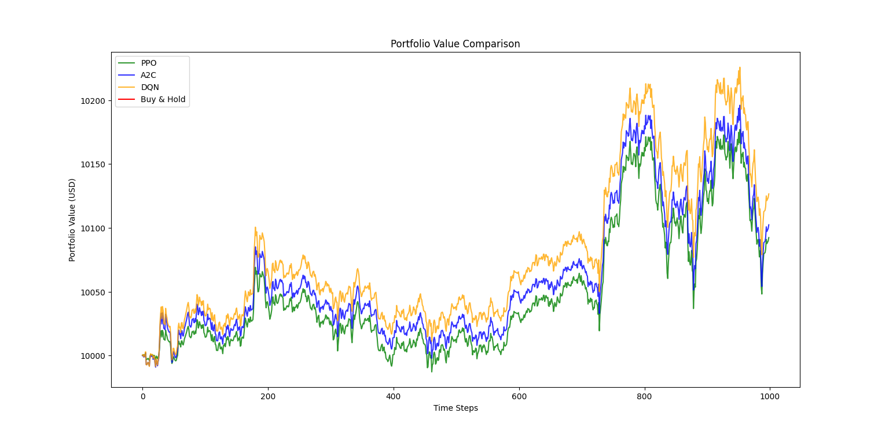

# RL Crypto Trading Bot

[](https://www.python.org/)
[](https://opensource.org/licenses/MIT)

A reinforcement learning-based cryptocurrency trading bot that implements and compares PPO, A2C, and DQN algorithms for BTC/USDT trading strategies.



## 📌 Project Overview

### Why RL for Crypto Trading?
- 24/7 market dynamics require adaptive strategies
- High volatility benefits from real-time decision making
- Eliminates emotional bias in trading

### Supported Algorithms
| Algorithm | Action Space | Key Strengths |
|-----------|--------------|---------------|
| **PPO**   | Discrete/Box | Balance between stability & performance |
| **A2C**   | Discrete/Box | Fast parallel training |
| **DQN**   | Discrete     | Experience replay mechanism |

## 🚀 Features
- Multi-algorithm comparison (PPO, A2C, DQN)
- Custom Gymnasium trading environment
- Real-time portfolio visualization
- Comprehensive metrics tracking:
  - Sharpe Ratio
  - Max Drawdown
  - Win Rate
  - Portfolio Volatility
- Buy & Hold strategy benchmarking

## 📊 Model Performance (BTC/USDT)

### Key Metrics Comparison
| Metric           | PPO    | A2C    | DQN    | Buy & Hold |
|------------------|--------|--------|--------|------------|
| **Avg Reward**   | -20.92 | -11.70 | 18.29  | -          |
| **Returns (%)**  | 0.14   | 0.09   | 0.07   | 0.02       |
| **Sharpe Ratio** | 0.31   | 0.21   | 1.11   | 0.30       |
| **Max Drawdown** | -1.66  | -1.57  | -0.23  | -0.17      |

### Algorithm Characteristics
```plaintext
PPO:
- Win Rate: 49.40%
- Volatility: 0.04

DQN (Best Performer):
- Highest Sharpe Ratio (1.11)
- Lowest Drawdown (-0.23%)

## ⚙️ Installation

1. Clone repository:
```bash
git clone https://github.com/Vnadh/RL-Crypto-Trading-Bot.git
cd RL-Crypto-Trading-Bot
```

2. Create virtual environment:
```bash
python -m venv myenv
source myenv/bin/activate  # Linux/Mac
myenv\Scripts\activate  # Windows
```

3. Install dependencies:
```bash
pip install -r requirements.txt
```

4. Download historical data:
```bash
python data_collection_preprocessing.py
```

## 🧠 Usage

### Train Models
```bash
# Train all models (PPO, A2C, DQN)
python train_model.py
```

### Evaluate Performance
```bash
# Generate metrics and comparison charts
python test_model.py
```
## 📈 Key Findings
1. **DQN Superiority**: Achieved highest risk-adjusted returns (Sharpe Ratio 1.11)
2. **PPO Consistency**: Best win rate (49.4%) among RL models
3. **Market Resilience**: All RL models outperformed Buy & Hold strategy

## 🤝 Contributing
Contributions are welcome! Please follow:
1. Fork the repository
2. Create your feature branch
3. Submit a pull request

## 📜 License
This project is licensed under the MIT License - see [LICENSE](LICENSE) file for details.

## Acknowledgments
- Stable Baselines3 team
- Gymnasium framework
- CCXT library for market data
``` 